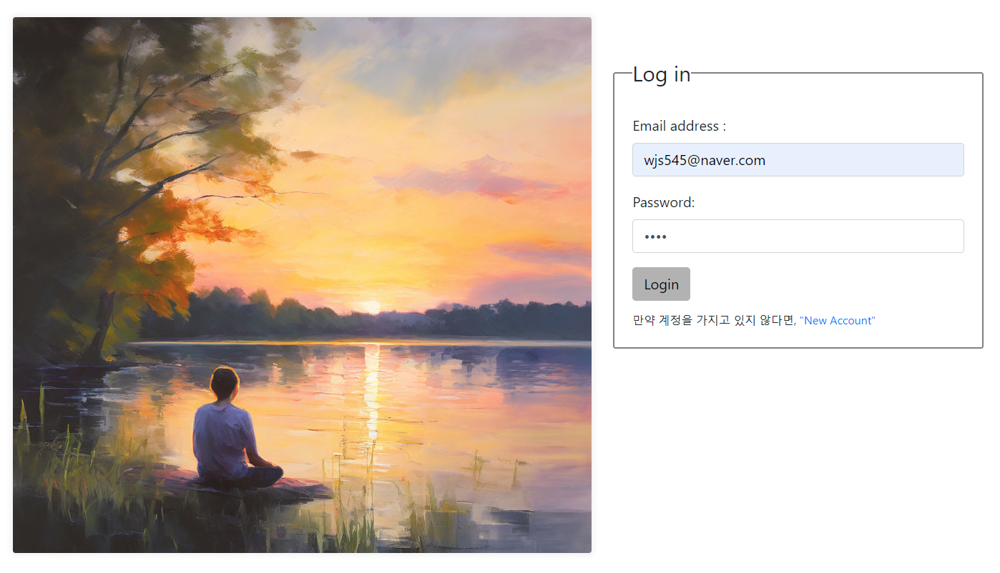
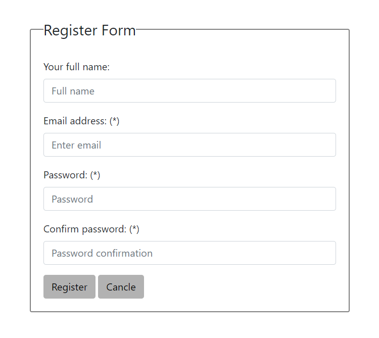
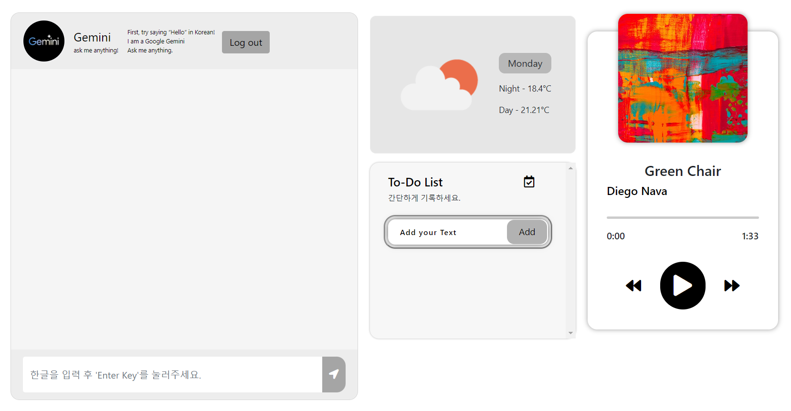

# PersonalChat
개인 심리 상담용 챗봇

# Technology Stack
- 조건 : JQuery 및 Ajax 사용하기
- Frontend : Html, Css, Javascript, JQuery, Ajax ...
- Backend : Node.js, Express ...
- sever : MySQL
- API : Gemini-Pro

# Task
- level1 : node.js에서 login 및 server CRUD 중 CRU 구현 (O)
- level2 : Google Gemini API 연결 (O)
- level3 : ToDo list CRUD 구현 (O)
  - local storage (O)
  - server (-)
- level4 : chat history 저장 기능 구현 (0)
- level5 : 코드 정리

# Task 추가 
-  open weather 추가, music player 추가 (O)
-  chat에게 query를 했을 때 현재 보낸 시간 및 응답 받은 시간 표시 (O)

# 추가해야될 사항
1. Todo list
    - image 인식부분 해결 필요 **( 해결 완료 ! )**
    - text가 box를 넘어갈때 줄바꿈 혹은 글자수 제한 기능 추가 필요 **( 한글은 줄바꿈 해결 ! → 영어 줄바꿈 X)**
2. chat history 기능은 구현했으나 user 입장에서 활용할 수 있도록 다운로드 버튼 구현 필요
3. 반응형 추가하기
    - 반응형이 적용 안된 부분을 찾아서 적용하기
4. server.js에서 gemini API 와 chat history를 .js파일들로 분리하기
5. 기능 추가해보면 좋을 것들
    - 전체 대화 내용을 사용자 입장에서 다운받을 수 있게 하기
    - 사용자가 계정정보를 삭제하는 기능 구현해보기
    - Multi-turn conversation Prompt 방법론 고안해서 추가 적용하기
7. open weather .env.OW_API_Key 인식 문제 (24.04.28)
8. open weather API 401 error **( 해결 )** (24.04.28)
9. music player 음량 조절 기능 추가하기

# 참고
- [발표자료 정리](https://wjs545.notion.site/Psychological-counseling-Bot-648aeb7e5ca743cfb57fe0602791120e?pvs=4)

# 구성
|Viewer| 
|---|
|
 </img>
|
|
 </img>
|
|
 </img>
|
